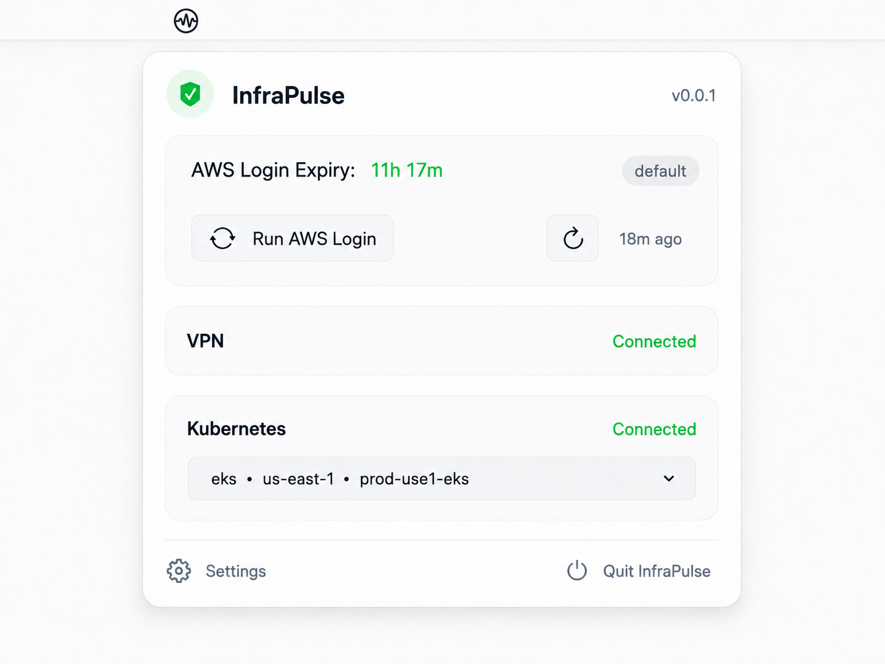
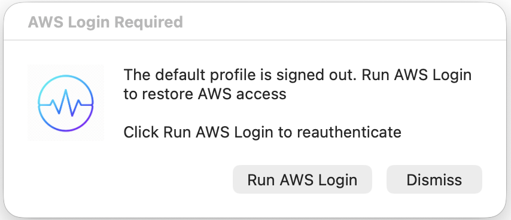

# InfraPulse

InfraPulse is a native macOS menu-bar app for keeping infrastructure
connectivity visible at a glance

When an AWS session expires, everything built on it stops working without saying why

**AI agents**, **MCP servers**, **Lens** starts failing silently

InfraPulse tells the moment it happens, *so you spend a few
seconds logging in again instead of minutes wondering what broke*

## Preview

<table>
  <tr>
    <td align="center">
      
    </td>
    <td align="center">
      
    </td>
  </tr>
  <tr>
    <td align="center">InfraPulse popover</td>
    <td align="center">AWS Login Required alert</td>
  </tr>
</table>

## In the menu bar

| Shows | Means |
| --- | --- |
| `AWS 3h 12m` | Signed in, with the time left before AWS Login expires |
| `Expired` | The session has ended and AWS-backed tools are failing now |
| `Signed out` | No AWS Login session for the selected profile |

Click it to open the popover, which shows AWS Login **Expiry**, VPN, and
Kubernetes together

## When AWS Login expires

A dialog appears as soon as InfraPulse notices, naming what has stopped working:

- **Run AWS Login** — sign in, no terminal needed
- **Dismiss** — quiet until your next login
- **Ignore** — it closes itself and returns, in case you never saw it

InfraPulse also re-checks on wake and when the network returns, the two moments
an expiry is most likely already waiting for you

## Features

### AWS Login

- Menu-bar countdown to session expiry, for the AWS CLI profile you choose
- Reads the real expiry from your AWS Login session rather than estimating it,
  using [session introspection](https://docs.aws.amazon.com/cli/latest/reference/signin/introspect-oauth2-token-with-iam.html)
  where available
- Notices an expired or signed-out session and prompts you to sign in again
- Start AWS Login straight from the popover
- Switch between AWS CLI profiles in **Settings**

### VPN

- Shows whether VPN is connected, including OpenVPN tunnels
- Recognises the office network from its public IP addresses and marks VPN as
  not required while you are on it

### Kubernetes

- Shows whether your current `kubectl` context can reach its cluster, and when
  it needs authentication
- Switch contexts directly in the popover
- Short, readable names for EKS contexts, with region and cluster

## Requirements

- macOS 13 or later
- AWS CLI v2.35.19+ with AWS Login support, configured with at least one profile
- `kubectl` for Kubernetes monitoring, which is optional and can be turned off
  in **Settings**

> [!NOTE]
InfraPulse starts automatically at log in to macOS

## Install

```bash
brew tap sunil-saini/tools
brew trust --cask sunil-saini/tools/infrapulse
brew install --cask sunil-saini/tools/infrapulse
```

After installation, InfraPulse appears in the menu bar and starts monitoring
the selected AWS profile

## Update

```bash
brew update
brew upgrade --cask sunil-saini/tools/infrapulse
```

The upgrade stops the old menu-bar service before replacing the app and
starts the new version automatically

## Logging

InfraPulse uses macOS Unified Logging. To inspect recent InfraPulse errors:

```bash
log show --last 1h --predicate 'subsystem == "com.infrapulse"'
```

To watch logs while reproducing an issue:

```bash
log stream --style compact --predicate 'subsystem == "com.infrapulse"'
```

## Settings

Open the InfraPulse menu-bar popover and choose **Settings** to select the AWS
profile to monitor or enable/disable Kubernetes monitoring

Kubernetes contexts can be switched directly from the popover

## Uninstall

```bash
brew uninstall --cask --zap sunil-saini/tools/infrapulse
rm -f ~/Library/Caches/Homebrew/Cask/infrapulse--*.zip
brew untap sunil-saini/tools
```
